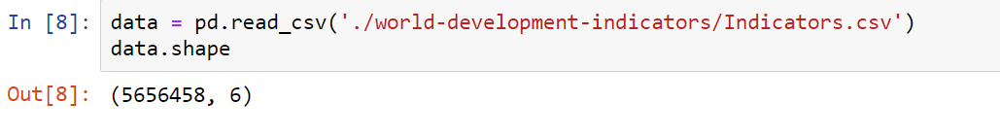
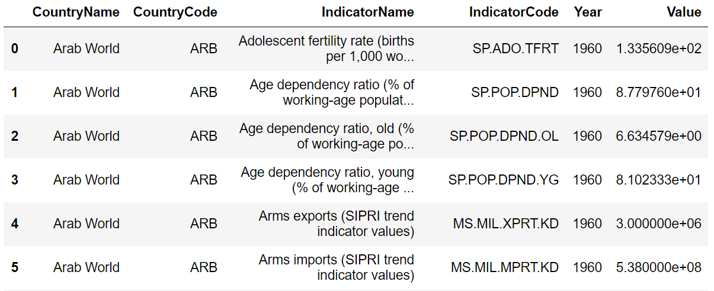
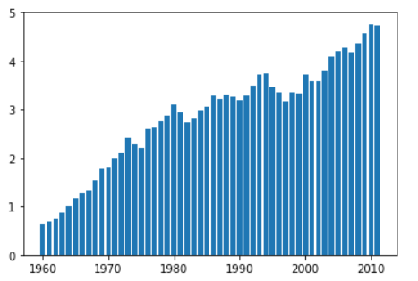
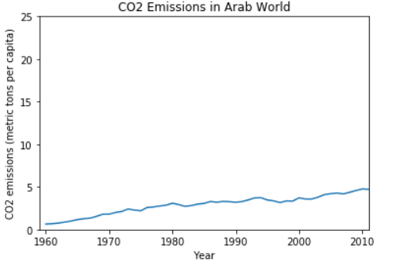
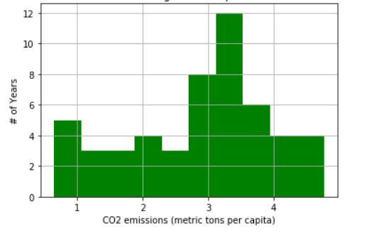
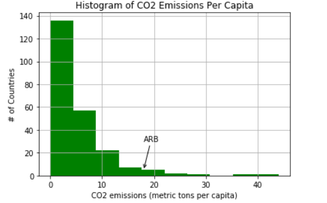

# Arab-world-data

---

Using data science techniques to filter and visualize the data, in this project we analyze this [world bank's](https://www.kaggle.com/worldbank/world-development-indicators) dataset from [kaggle](https://www.kaggle.com) to draw conclusions and produce visualizations about the green house contributions of the Arab world. 

**Note:** The Arab World consists of **22 countries** in the Middle East and North Africa: Algeria, Bahrain, the Comoros Islands, Djibouti, Egypt, Iraq, Jordan, Kuwait, Lebanon, Libya, Morocco, Mauritania, Oman, Palestine, Qatar, Saudi Arabia, Somalia, Sudan, Syria, Tunisia, the United Arab Emirates, and Yemen.

---

### If you want to run the project locally, run these commands on your local machine

- Clone the repository

  ```bash
  git clone https://github.com/Reepulse/Arab-world-data.git
  ```

- Change directory to Arab-world-data

  ```bash
  cd Arab-world-data
  ```

- Install the required packages

  ```bash
  pip install folium numpy pandas matplotlib
  ```

- Start the `jupyter server`

  ```bash
  jupyter notebook
  ```

- This will open `jupyter client` in your browser window

- Now open the `analysis.ipynb` and play with the notebook

- I have also created a geographic map representing emissions using `folliom`. `create_map.ipynb` is the notebook for creating map and you can view map by opening `plot_data.html` in the browser

---

**Note**: You must have `jupyter notebook` configured with latest version of python in your local machine for this to work. If you don't have it configured then you use [anaconda](https://docs.anaconda.com/anaconda/install/) to install these

**Note**: In this project I analyzed Indicators.csv from the [word banks](https://www.kaggle.com/worldbank/world-development-indicators) data set. It is only a part of the dataset, original dataset contains a lot more data. You can download the dataset for more analysis

---

# Glimpse at the analysis





> Lots of data to analyze

### Analyzing the data, I created some visualizations to draw conclusions





> Turns out that over years emissions per capita have just increased.





> Turns out that Arab world countries produce 3-4 metric tons co2 per capita on average

